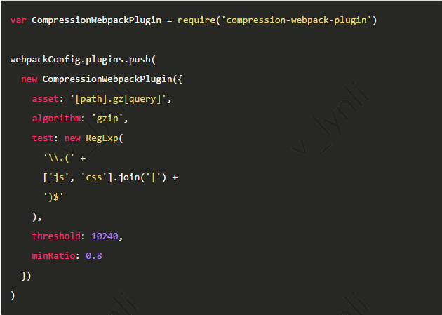

## Web前端性能优化——如何有效提升静态文件的加载速度
#### 一、如何优化

 

用户在访问网页时， 最直观的感受就是页面内容出来的速度，我们要做的优化工作， 也主要是为了这个目标。那么为了提高页面加载（或者渲染）速度呢？一般来说有三个方面：

 

1、代码逻辑：优秀的代码逻辑结构可以有效减少渲染页面使用的内存和速度（比如虚拟DOM），此方面不在本文讨论范围内。

 

2、SSR服务器渲染，也就是所谓的“直出”。将首屏所有内容在服务器端渲染成html静态代码后，直接输出给浏览器，可以有效加快用户访问站点时首屏的加载时间。不过此方面也不在本文讨论范围内。

 

3、提升静态文件的加载速度，这是本文会讨论的点，而这方面大致又可分为下面几点：

 

— 加快静态文件下载速度

 

— 减少静态文件的文件大小

 

— 减少静态文件请求数量，从而减少发起请求的次数（对于移动端页面来说，请求的开销比网速的开销要大）

 

 

 

 （一）代码压缩

 

最常规的优化手段之一。

 

我们在平时开发的时候，JS脚本文件和CSS样式文件中的代码，都会依据一定的代码规范（比如javascript-standard-style）来提高项目的可维护性，以及团队之间合作的效率。

 

但是在项目发布现网后， 这些代码是给客户端（浏览器）识别的，此时代码的命名规范、空格缩进都已没有必要，我们可以使用工具将这些代码进行混淆和压缩，减少静态文件的大小

 

这里我们选择使用Webpack，具体会在后面介绍。

 

 

 

 （二）文件合并

 

在npm流行的今天，前端在进行项目开发的时候，往往会使用很多第三方代码库，比如jQuery，axios，weixin-js-sdk，lodash，bootstrap等等，每个库都有属于自己的脚本或者样式文件。

 

按照最老的方式的话，我们会用<script>标签或者<style>标签分别引入这些库文件，导致在打开一个页面的时候会发起几十个请求，这对于移动端来说是不可接受的。

 

在减少文件请求数量方面大致有以下三方面：

 

1、合并js脚本文件

 

2、合并css样式文件

 

3、合并css引用的图片，使用sprite雪碧图。

（三）gzip

 

我们的文件在压缩合并之后，文件大小和文件数量都有了客观的减少。但是一旦站点业务逻辑多了，或者引入的第三方库多了之后，对于移动端来说，文件大小还是不太乐观。

 

这个时候就是gzip压缩登场的时候啦~我们在webpack的配置中增加gzip压缩配置：

 

 

 

上面代码会对文件大小大于10240，并且压缩率好于0.8的js、css文件进行gzip压缩，执行打包代码后生成结果文件如下：
